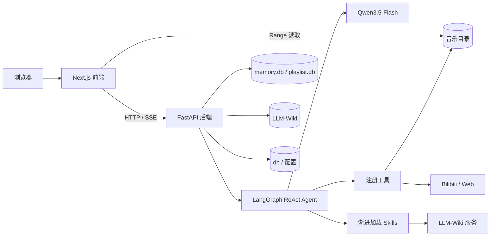

# Musicer 项目架构说明

> 文档状态：当前架构基线 + 目标演进
> 更新日期：2026-10-02
> 关联文档：[需求文档](./需求文档.md) · [记忆系统说明](./记忆系统说明.md) · [安装说明](../install.md)

本文是项目架构的唯一总览。章节中的能力使用以下状态：

- **已实现**：当前代码和 Docker 运行链路已经提供。
- **部分实现**：已有基础能力，但尚未形成完整产品闭环。
- **规划**：需求已经明确，当前代码尚未提供，不得在 README 中描述为稳定能力。

## 1. 系统定位

Musicer 是面向个人曲库的智能音乐播放器。系统把浏览器播放器、个人音乐文件、B 站音频来源、Qwen ReAct Agent、用户记忆和 LLM-Wiki 组合为一个本地优先的应用。

核心边界：

- 播放会话保存“当前播放什么、接下来播放什么”；LLM-Wiki 保存“音乐对象是什么”。
- 用户记忆保存“用户偏好和会话事实”；不得把网页或 Wiki 事实自动写成用户偏好。
- LLM 负责理解意图和规划工具；文件写入、数据库一致性、证据校验和危险操作由确定性代码约束。
- 本地文件路径是播放事实。Wiki 重置不会删除、移动或重命名音乐文件。

## 2. 运行架构



Docker Compose 是正式部署入口：

- `frontend` 容器运行 Next.js 16，容器端口 `3002`，默认映射到宿主机 `3000`。
- `backend` 容器运行 FastAPI，端口 `8000`，镜像内包含 Python、yt-dlp、浏览器模拟依赖、ffmpeg、根目录 `skills/` 和 `template/`。
- 两个容器挂载同一宿主机音乐目录；前端只读，后端可写以保存下载结果。
- `memory/data`、`LLM-Wiki` 和 `db` 以绑定目录持久化，重建镜像不丢失数据。

完整安装与数据卷说明见 [install.md](../install.md)。

## 3. 前端层

### 3.1 页面与组件

**已实现。** `frontend/app/page.tsx` 组合单页播放器界面；组件按 Atomic Design 分为：

- `components/atoms/`：图标、标签、滑块、徽章等基础元素。
- `components/molecules/`：控制条、进度条、音量、聊天消息、场景选择等组合控件。
- `components/organisms/`：本地曲库、最近播放、我的歌单、播放详情、接下来播放、Agent 聊天、设置面板和可视化背景等业务区域。

Agent 消息通过 `react-markdown` 和 `remark-gfm` 渲染安全 Markdown，支持标题、列表、表格、引用、链接和代码块；不解析原始 HTML，也不直接加载 Markdown 图片。用户消息保持纯文本。结构化 Track 卡片独立于 Markdown，旧版 `tracks/json/added` 数据块仍兼容转换为 Track 卡片。

### 3.2 客户端状态

**已实现。** `frontend/app/context/` 是浏览器运行时状态入口：

- `PlayerContext.tsx`：PlaybackSession、当前项、顺序/随机/Radio、循环策略、真实播放历史、进度和音量。
- `PlaylistContext.tsx`：命名歌单 CRUD、项目增删和排序；不直接修改 PlaybackSession。
- `AgentContext.tsx`：会话、SSE 事件、Agent 返回的播放器动作、语音播报和场景。
- `DanmakuContext.tsx`：BVID 对应弹幕及播放时间同步。
- `ModeContext.tsx`：本地/云端检索界面模式。

`PlayerContext` 维护当前 `PlaybackSession`，用户界面只展示“播放详情”和“接下来播放”。播放会话是临时运行状态，不是可命名、可复用的歌单；`PLAY` 会在必要时先加入会话，`ADD` 只加入而不打断当前播放，`DOWNLOAD` 只改变本地可用性。会话项目、当前项、播放模式、循环策略、进度和音量由后端以 revision 乐观并发控制持久化。

### 3.3 Next.js API 路由

**已实现。** `frontend/app/api/` 包含两类路由：

- 后端代理：聊天、配置、历史、场景、播放会话、语音和 Wiki 状态。
- 前端服务：音乐文件扫描/Range 传输以及部分 B 站访问逻辑。

服务端路由通过 `BACKEND_URL` 访问 FastAPI；浏览器默认使用同源 `/api`。音乐目录通过绝对 `MUSIC_DIR=/music` 注入容器，避免依赖容器工作目录推导。

## 4. 后端层

### 4.1 应用入口与路由

**已实现。** `backend/main.py` 创建 FastAPI 应用、注册路由并管理生命周期：

- 启动时初始化系统文件、记忆数据库和播放会话数据库，并无损迁移旧 `playlist` 表。
- 后台 Dream 调度器按 `DREAM_INTERVAL_HOURS` 处理待整理会话。
- `/health` 用于容器健康检查。

`backend/routers/` 负责 HTTP 协议、参数和响应；核心业务放在 `backend/services/`。主要领域包括 chat、config、tracks、search、bili、playback、scenario、history、memory、dream、voice 和 wiki。

### 4.2 业务服务

| 服务入口 | 当前职责 | 状态 |
| --- | --- | --- |
| `ai_agent.py` | ReAct 图、上下文组装、工具注册、流式事件 | 已实现 |
| `llm_client.py` | Qwen OpenAI-compatible 客户端和任务参数 | 已实现 |
| `music_manager.py` | 本地音乐扫描、匹配和元数据解析 | 已实现 |
| `bili_client.py` | B 站搜索和弹幕接口 | 已实现 |
| `bili_downloader.py` | B 站 URL 校验、串行下载、Cookie、错误分类和 MP3 落盘 | 已实现 |
| `web_tools.py` | Qwen 联网搜索、网页抓取、安全过滤和缓存 | 已实现 |
| `voice_service.py` | Qwen ASR/TTS | 已实现 |
| `playback_session_store.py` | 当前播放会话、会话项目和 revision 并发控制 | 已实现 |
| `music_library_store.py` | 命名歌单、播放事件、显式反馈和最近播放聚合 | 已实现 |
| `recommendation_service.py` | 本地 Radio 候选过滤和稳定轮换；不下载、不修改命名歌单 | 已实现（基础版） |
| `playlist_store.py` | 旧 `/api/playlist` 的兼容适配层 | 已实现（弃用） |
| `memory_store.py` / `memory_manager.py` / `episode_memory.py` | 原始事件、episode 召回、候选、长期记忆和画像投影 | 已实现 |
| `dream_engine.py` | 从用户消息提取并审核长期记忆候选 | 已实现 |
| `wiki_manager.py` / `wiki_ingest.py` / `wiki_operations.py` | Wiki 初始化、构建、检索、审计和重置 | 已实现 |
| 智能推荐排序服务 | 基于近期偏好、场景和多样性的智能歌单排序 | 规划 |

## 5. Agent 架构

### 5.1 ReAct 循环

**已实现。** `backend/services/ai_agent.py` 使用 LangGraph 构建 Agent、Tool 和协议校验节点：模型接收系统上下文和消息，自主选择零个或多个工具；工具结果返回模型，直到生成最终回答。工具通过模型 function calling 注册，系统提示词只描述身份、边界和输出协议，不重复完整工具说明，也不固定业务路由。最终回答进入确定性协议守卫，伪工具命令、未完成的执行承诺和缺少工具证据的成功声明会被拦截并最多修复一次。

每轮上下文当前包含：

1. 基础系统规则与场景信息。
2. 当前场景和全局的结构化长期记忆，最多 20 条。
3. 与当前请求相关且达到阈值的 episode，最多 3 条；无命中时不占上下文。
4. 当前会话最近 16 条 user/agent 消息。
5. 当前用户输入和浏览器上报的播放器状态。
6. 可用 Skill 的名称与简介；完整 `SKILL.md` 只在 `activate_skill` 后进入上下文。

### 5.2 已注册工具

**已实现。** 当前工具按能力分组：

- Skill：`activate_skill`、`execute_skill_script`、`load_skill_reference`。
- 播放器：`get_player_state`、`control_player`、`play_track`、`manage_playback_session`、`set_playback_mode`。指定歌曲播放必须使用经过本地曲库校验的 `track_id`；待播操作只修改 PlaybackSession。
- 歌单：`list_music_playlists`、`create_music_playlist`、`add_track_to_music_playlist`、`play_music_playlist`、`manage_music_playlist`；播放歌单只复制快照到 PlaybackSession，保存当前播放详情才会显式创建命名歌单。
- 反馈：`record_track_feedback` 追加记录用户明确表达的喜欢、不喜欢、版本不喜欢和暂时不听；不直接生成长期记忆。
- 音乐来源：`local_search`、`bili_search`、`convert_video`；`present_tracks` 只能展示本轮真实搜索登记过的 Track 标识。
- 网络证据：`web_search`、`web_fetch`。
- 记忆：`search_memory`、`remember_preference`、`forget_preference`。

`execute_skill_script` 只执行已发现 Skill 的 `scripts/*.py`，使用当前 Python 解释器直接传递 JSON 参数数组，不经过 Shell，并限制脚本路径、参数规模和执行时间。普通音乐 Agent 不提供通用 `bash` 和任意文件读取；`load_skill_reference` 只能读取已发现 Skill 的 `references/` 文本资源。

### 5.3 Skill 机制

**已实现。** Skill 位于根目录 `skills/<name>/`：

- `SKILL.md`：名称、简介、触发条件和工作流。
- `scripts/`：需要确定性执行的脚本。
- `references/`：按需读取的详细说明。

当前可发现的 Skill 包括 `local-search`、`cloud-search`、`convert` 和 `llm-wiki`。模型先看到元数据，在意图匹配时调用 `activate_skill` 加载完整正文；需要运行确定性流程时再调用 `execute_skill_script`。

`activate_skill` 返回 `SKILL.md`，Skill 明确引用的详细材料通过 `load_skill_reference` 渐进读取；路径限制在对应 Skill 的 `references/` 目录。脚本继续只能通过 `execute_skill_script` 执行。

## 6. 记忆与上下文

**已实现 v2.1，episode 条件召回已接入。** 记忆事实源是 `memory/data/memory.db`：

- 工作上下文：当前会话最近 16 条消息。
- 原始事件：完整消息、工具调用和工具结果，是可追溯证据。
- 事件记忆：每轮保存目标、场景约束、实际工具、结果状态、实体引用和来源消息 ID；不保存隐藏思维链。
- 候选记忆：Dream 从用户消息生成，保留来源消息 ID、置信度和证据类型。
- 长期记忆：只有通过确定性门槛的候选成为有效指令。
- Markdown 画像：长期记忆的可检查投影，不是主要事实源。

只有推荐、歌单、搜索、下载、纠正、个性化或显式历史等请求会检索 episode，命中相关度阈值时注入最多 3 条；简单播放器控制、能力说明和概念解释不查询 episode。当前排序使用中文二元词/关键词、场景、时间衰减、重要度、置信度和结果状态，只召回成功或部分成功记录；协议阻断等失败记录保留作审计但不注入。当前还不是 embedding 语义召回。`search_memory` 仍由模型按需调用，底层是 SQL `LIKE`。上下文按消息条数截断，尚无 Token 预算和会话摘要压缩。详细数据表、晋升策略和缺口见[记忆系统说明](./记忆系统说明.md)。

## 7. LLM-Wiki

### 7.1 职责边界

**已实现。** LLM-Wiki 保存有来源的音乐知识，包括歌曲、歌手、专辑、流派、录音版本候选、别名和关系。它不保存播放会话、用户偏好或当前播放状态。

本地歌曲与 Wiki 实体通过文件路径、BVID 和归一化身份信息关联。关联不确定时保留候选和 `needs_review`，不能为了强行匹配而覆盖真实路径或虚构歌手/版本。

### 7.2 执行链路

知识库任务由 `llm-wiki` Skill 约束，`scripts/wiki_ops.py` 提供：

- `status`：状态检查。
- `search`：确定性查询。
- `ingest`：默认仅预览，显式 `--apply` 才写入。
- `audit`：证据与图谱质量审计。
- `reset`：默认预览，显式 `--apply` 才重置，并生成恢复清单。

联网搜索只产生候选证据；写入必须经过网页抓取、引用/哈希和后端校验。转换下载与 Wiki 入库是两个独立授权动作。

## 8. 数据与生命周期

| 数据 | 存储 | 所有者 | 生命周期 |
| --- | --- | --- | --- |
| MP3 文件 | `${MUSIC_PATH}` | 用户/播放器 | 独立于 Wiki 和容器 |
| 当前播放会话 | `memory/data/playlist.db` | playback session 服务 | 持久化；旧 `playlist` 表保留用于兼容迁移 |
| 命名歌单、播放事件与反馈事件 | `memory/data/music-library.db` | music library 服务 | 歌单长期保存；事件追加写入，用于最近播放和推荐过滤 |
| 会话与长期记忆 | `memory/data/memory.db` | memory 服务 | 可审计、可软删除/重置 |
| 用户画像投影 | `memory/data/*.md` | memory 服务 | 由结构化记忆生成 |
| 音乐知识 | `LLM-Wiki/` | llm-wiki 服务与 Skill | 可审计、可独立重置 |
| Wiki 同步任务 | `db/wiki-sync.db` | wiki sync 服务 | 下载后持久化，支持幂等重试 |
| 场景与恢复清单 | `db/` | scenario/wiki 服务 | 独立持久化 |
| API 密钥 | `backend/.env.local` | 部署者 | 不进入镜像和版本库 |

## 9. 关键调用链

### 9.1 对话与播放控制

```text
用户输入/ASR
→ Next.js /api/chat
→ FastAPI chat router
→ 组装最近消息、长期记忆、场景、播放器快照
→ ReAct 决策
→ get_player_state / control_player / play_track / 搜索工具
→ 协议守卫校验最终回答
→ SSE 返回文本、结构化 track_cards 或 client_action
→ AgentContext 分发到 PlayerContext
```

### 9.2 本地优先搜索与下载

```text
自然语言搜索
→ local-search Skill + local_search
→ 命中：直接返回本地 track
→ 未命中或用户明确要求云端：cloud-search + bili_search
→ present_tracks 只展示本轮真实搜索候选
→ 用户点击具体 Track 的 DOWNLOAD，客户端提交 selected_tracks
→ convert Skill + convert_video
→ bili_downloader 使用 yt-dlp 串行获取并由 ffmpeg 转为 MP3
→ MP3 写入挂载音乐目录
→ 返回规范本地 Track 并登记最小 Wiki 来源身份
```

下载服务默认使用浏览器模拟、有限重试和单分片并发，可选读取只读挂载的 Netscape Cookie。B 站 `412 request was banned` 被识别为出口 IP 或登录状态风控并停止本轮重试；部署者需要让 B 站域名绕过受限 VPN 出口，或提供有效 Cookie，应用不会尝试绕过平台风控。

下载成功后，后端创建持久化 Wiki 同步任务并自动登记最小来源身份，包括 BVID、本地路径、哈希和原始来源。这不会生成或提升歌曲、歌手、专辑、版本等语义实体。语义知识富化仍必须单独激活 `llm-wiki` 并遵守预览/应用协议；同步失败也不会回滚或删除本地音频。

### 9.3 记忆沉淀

```text
会话消息落库
→ 本轮结束生成可追溯 episode
→ 后续请求在模型调用前自动检索并条件注入
→ 待处理用户证据达到阈值或定时调度
→ Dream 提取候选
→ 校验来源 ID、证据类型和置信度
→ 晋升或拒绝
→ 有效记忆投影到画像并进入后续上下文
```

## 10. 安全与可靠性

当前已有：

- 配置与密钥分离，Docker 构建上下文排除 `.env.local`。
- Skill 脚本白名单目录、无 Shell 参数执行、超时和参数限制。
- Wiki 入库/重置默认预览，写操作需要显式应用。
- 网页抓取阻止本地/私网目标，外部正文视为不可信数据。
- Wiki 重置与音乐目录分离，并写入恢复清单。
- 后端单元/集成测试覆盖 Agent 提示词、工具、记忆、Wiki、语音和 API。

部署限制：当前没有用户认证、权限隔离和 Agent 命令沙箱，CORS 也允许任意来源。因此架构面向本地单用户环境，不应直接暴露到公网。

## 11. 目标演进

以下能力已经进入[需求文档](./需求文档.md)，但尚未形成稳定实现：

| 优先级 | 目标 | 主要架构变化 |
| --- | --- | --- |
| 已完成 | 命名歌单与播放会话分离 | NamedPlaylist 长期集合、PlaybackSession 临时状态、PlaybackEvent 行为事实 |
| 已完成（基础版） | 顺序、随机、Radio 播放 | 前端状态机持久化模式和真实历史；随机袋避免周期内重复；Radio 只补充本地候选 |
| 已完成（基础版） | 播放行为与显式反馈事实 | 记录开始、恢复、暂停、完成、跳过、停止及喜欢/不喜欢等追加事件 |
| P1 | 一键智能歌单 | LLM 解析约束，确定性候选过滤、排序、多样性和解释 |
| P1 | 近期偏好与反馈闭环 | 从播放事件计算短期画像，不直接污染长期记忆 |
| P1 | 隐式记忆召回增强 | 在已实现关键词/场景召回上增加 embedding、离线评测和反馈调权 |
| P1 | 对话压缩 | Token 阈值、结构化会话摘要、最近消息窗口 |
| P2 | 稳定歌曲/版本身份 | track/recording/work/wiki_entity 映射与人工校正 |
| 已完成 | Skill 资源渐进加载 | 受限资源读取、脚本执行和激活状态记录 |

未来实现必须维持现有边界：推荐结果最终引用真实 `track_id`；LLM 不能直接修改数据库；播放事件、用户记忆和音乐知识分别存储；所有自动化决策可追溯。

## 12. 测试地图

- `backend/tests/test_agent_prompt.py`：系统提示词和 Skill 元数据。
- `backend/tests/test_player_tools.py`：浏览器播放器工具。
- `backend/tests/test_music_library_store.py`：命名歌单、排序、revision 和最近播放事件。
- `backend/tests/test_playback_session_store.py`：播放会话、导航历史、随机袋和并发 revision。
- `backend/tests/test_recommendation_service.py`：Radio 的本地边界、最近播放排除和负反馈排除。
- `backend/tests/test_memory_store.py`：记忆数据和晋升规则。
- `backend/tests/test_episode_memory.py`：episode 写入、实体引用与条件召回。
- `backend/tests/test_wiki_*.py`：Wiki 构建、重置和 Skill 脚本。
- `backend/tests/test_web_tools.py`：联网搜索与抓取边界。
- `backend/tests/test_voice_service.py`：ASR/TTS 服务。
- `backend/tests/test_api.py`：主要 HTTP 接口。
- `npm run build`：前端类型和生产构建。
- `docker compose config --quiet && docker compose build`：正式安装链路；`--quiet` 避免展开并打印密钥。
