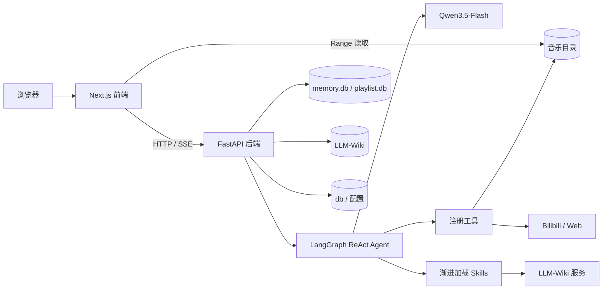

# Musicer 项目架构说明

> 文档状态：当前架构基线 + 目标演进
> 更新日期：2026-10-02
> 关联文档：[需求文档](./需求文档.md) · [记忆系统说明](./记忆系统说明.md) · [安装说明](../install.md)

本文是项目架构的唯一总览。章节中的能力使用以下状态：

- **已实现**：当前代码和 Docker 运行链路已经提供。
- **部分实现**：已有基础能力，但尚未形成完整产品闭环。
- **规划**：需求已经明确，当前代码尚未提供，不得在 README 中描述为稳定能力。

## 1. 系统定位

Musicer 是面向个人曲库的智能音乐播放器。系统把浏览器播放器、个人音乐文件、B 站音频来源、Qwen ReAct Agent、用户记忆和 LLM-Wiki 组合为一个本地优先的应用。

核心边界：

- 播放会话保存“当前播放什么、接下来播放什么”；LLM-Wiki 保存“音乐对象是什么”。
- 用户记忆保存“用户偏好和会话事实”；不得把网页或 Wiki 事实自动写成用户偏好。
- LLM 负责理解意图和规划工具；文件写入、数据库一致性、证据校验和危险操作由确定性代码约束。
- 本地文件路径是播放事实。Wiki 重置不会删除、移动或重命名音乐文件。

## 2. 运行架构



Docker Compose 是正式部署入口：

- `frontend` 容器运行 Next.js 16，容器端口 `3002`，默认映射到宿主机 `3000`。
- `backend` 容器运行 FastAPI，端口 `8000`，镜像内包含 Python、yt-dlp、浏览器模拟依赖、ffmpeg、根目录 `skills/` 和 `template/`。
- 两个容器挂载同一宿主机音乐目录；前端只读，后端可写以保存下载结果。
- `memory/data`、`LLM-Wiki` 和 `db` 以绑定目录持久化，重建镜像不丢失数据。

完整安装与数据卷说明见 [install.md](../install.md)。

## 3. 前端层

### 3.1 页面与组件

**已实现。** `frontend/app/page.tsx` 组合单页播放器界面；组件按 Atomic Design 分为：

- `components/atoms/`：图标、标签、滑块、徽章等基础元素。
- `components/molecules/`：控制条、进度条、音量、聊天消息、场景选择等组合控件。
- `components/organisms/`：本地曲库、最近播放、我的歌单、智能歌单、下载任务、播放详情、接下来播放、Agent 聊天、设置面板和可视化背景等业务区域。

Agent 消息通过 `react-markdown` 和 `remark-gfm` 渲染安全 Markdown，支持标题、列表、表格、引用、链接和代码块；不解析原始 HTML，也不直接加载 Markdown 图片。用户消息保持纯文本。结构化 Track 卡片独立于 Markdown，旧版 `tracks/json/added` 数据块仍兼容转换为 Track 卡片。

### 3.2 客户端状态

**已实现。** `frontend/app/context/` 是浏览器运行时状态入口：

- `PlayerContext.tsx`：PlaybackSession、当前项、顺序/随机/Radio、循环策略、真实播放历史、进度和音量。
- `PlaylistContext.tsx`：命名歌单 CRUD、项目增删和排序；不直接修改 PlaybackSession。
- `ScenarioContext.tsx`：场景列表、当前场景和跨播放器/Agent 的共享状态。
- `AgentContext.tsx`：会话、SSE 事件、Agent 返回的播放器动作和语音播报。
- `DanmakuContext.tsx`：BVID 对应弹幕及播放时间同步。
- `ModeContext.tsx`：本地/云端检索界面模式。

`PlayerContext` 维护当前 `PlaybackSession`，用户界面只展示“播放详情”和“接下来播放”。播放会话是临时运行状态，不是可命名、可复用的歌单；`PLAY` 会在必要时先加入会话，`ADD` 只加入而不打断当前播放，`DOWNLOAD` 只改变本地可用性。会话项目、当前项、播放模式、循环策略、进度和音量由后端以 revision 乐观并发控制持久化。Agent 下发的浏览器动作带唯一 `action_id`，`AgentContext` 执行后向后端回传成功或失败 ACK；播放动作只有观察到音频开始播放后才报告成功。

### 3.3 Next.js API 路由

**已实现。** `frontend/app/api/` 包含两类路由：

- 后端代理：聊天、配置、历史、场景、播放会话、语音和 Wiki 状态。
- 前端服务：音乐文件扫描/Range 传输以及部分 B 站访问逻辑。

服务端路由通过 `BACKEND_URL` 访问 FastAPI；浏览器默认使用同源 `/api`。音乐目录通过绝对 `MUSIC_DIR=/music` 注入容器，避免依赖容器工作目录推导。

## 4. 后端层

### 4.1 应用入口与路由

**已实现。** `backend/main.py` 创建 FastAPI 应用、注册路由并管理生命周期：

- 启动时初始化系统文件、记忆数据库和播放会话数据库，并无损迁移旧 `playlist` 表。
- 后台 Dream 调度器按 `DREAM_INTERVAL_HOURS` 处理待整理会话。
- `/health` 用于容器健康检查。

`backend/routers/` 负责 HTTP 协议、参数和响应；核心业务放在 `backend/services/`。主要领域包括 chat、config、tracks、search、bili、playback、scenario、history、memory、dream、voice 和 wiki。

### 4.2 业务服务

| 服务入口 | 当前职责 | 状态 |
| --- | --- | --- |
| `ai_agent.py` | ReAct 图、上下文组装、工具注册、流式事件 | 已实现 |
| `llm_client.py` | Qwen OpenAI-compatible 客户端和任务参数 | 已实现 |
| `music_manager.py` | 本地音乐扫描、匹配和元数据解析 | 已实现 |
| `bili_client.py` | B 站搜索和弹幕接口 | 已实现 |
| `bili_downloader.py` | B 站 URL 校验、串行下载、Cookie、错误分类和 MP3 落盘 | 已实现 |
| `download_job_service.py` | SQLite 下载任务、单工作线程、进度、取消、恢复、失败重试与下载后 Wiki 构建入队 | 已实现 |
| `web_tools.py` | Qwen 联网搜索、网页抓取、安全过滤和缓存 | 已实现 |
| `voice_service.py` | Qwen ASR/TTS | 已实现 |
| `playback_session_store.py` | 当前播放会话、会话项目和 revision 并发控制 | 已实现 |
| `player_action_store.py` | Agent 浏览器动作、action_id 与执行 ACK 的关联审计 | 已实现 |
| `music_library_store.py` | 命名歌单、播放/反馈事件、推荐批次和逐曲理由 | 已实现 |
| `preference_service.py` | 从追加事件计算带时间衰减、可按当前场景过滤的近 7/30 天短期画像 | 已实现（基础版） |
| `recommendation_service.py` | 对话推荐的场景/记忆/Wiki 候选、50% 本地/云端动态配额，以及本地 Radio 排序和批次审计 | 已实现（基础版） |
| `playlist_store.py` | 旧 `/api/playlist` 的兼容适配层 | 已实现（弃用） |
| `memory_store.py` / `memory_manager.py` / `episode_memory.py` | 原始事件、episode 召回、候选、长期记忆和画像投影 | 已实现 |
| `agent_context.py` / `episode_evidence.py` / `memory_task_service.py` | ReAct 上下文刷新、结构化回执、跨轮草稿/下载任务引用；详细边界见[记忆系统说明](./记忆系统说明.md) | 已实现（P0/P1 基础版） |
| `dream_engine.py` | 从用户消息提取并审核长期记忆候选 | 已实现 |
| `wiki_manager.py` / `wiki_ingest.py` / `wiki_operations.py` | Wiki 初始化、构建、检索、审计和重置 | 已实现 |
| `smart_playlist_service.py` | 本地/联网智能歌单过滤、偏好排序、时长、预览审计和下载入歌单 | 已实现（基础版；音乐特征约束会显式降级） |
| `playlist_draft_service.py` | 会话草稿、逐项编辑、版本校验、显式确认和幂等提交回执 | 已实现 |

## 5. Agent 架构

### 5.1 ReAct 循环

**已实现。** `backend/services/ai_agent.py` 使用 LangGraph 构建 Agent、Tool、客户端动作等待节点和协议校验节点：模型接收系统上下文和消息，自主选择零个或多个工具；工具结果返回模型，直到生成最终回答。工具通过模型 function calling 注册，系统提示词只描述身份、边界和输出协议，不重复完整工具说明，也不固定业务路由。浏览器动作会等待真实 ACK 并把结果重新提供给 Agent。最终回答进入确定性协议守卫；伪工具命令、未完成的执行承诺和缺少证据的成功声明会被拦截。模型修复仍失败时，系统根据真实 ACK 或 `present_tracks` 结果生成受限答复，不再使用无差别通用兜底。

Agent 每轮最多进行 12 次工具规划循环，在 LangGraph 的 50 节点硬上限前停止新增操作并汇报已观察结果。执行异常也会生成并持久化基于真实工具回执的中文回复，而不是只返回原始异常。已提交的歌曲/歌单修改不会因 Agent 中断自动回滚；存在已确认写入时 episode 记录为部分完成，不自动重复执行写入。前端消费完整 JSON 回执，及时刷新手动工具和智能歌单工具修改的命名歌单。

智能补歌复用 `smart_playlist_service`：预览携带 `target_playlist_id` 和目标 revision，选曲排除歌单已有 Track/BVID；应用时原子追加本地子集并写入批次幂等回执，联网下载任务绑定同一目标歌单。目标已删除、无所有权或首次应用前 revision 变化时拒绝写入；重复应用同一批次不重复添加或创建下载任务。智能补歌不复制当前播放内容、不新建同名替代歌单，也不改变播放会话；具体 Agent 操作边界见 `skills/smart-playlist/SKILL.md`。

每轮上下文当前包含：

1. 基础系统规则与场景信息。
2. 全局强制约束与当前请求相关的当前场景/全局长期记忆，最多 6 条。
3. 与当前请求相关且达到阈值的 episode，最多 3 条；无命中时不占上下文。
4. 当前会话最近 16 条 user/agent 消息。
5. 当前用户输入和浏览器上报的播放器状态。
6. 可用 Skill 的名称与简介；完整 `SKILL.md` 只在 `activate_skill` 后进入上下文。

### 5.2 已注册工具

**已实现。** 当前工具按能力分组：

- Skill：`activate_skill`、`execute_skill_script`、`load_skill_reference`。
- 播放器：`get_player_state`、`control_player`、`play_track`、`manage_playback_session`、`set_playback_mode`。指定歌曲播放必须使用经过本地曲库校验的 `track_id`；待播操作只修改 PlaybackSession。
- 歌单：`list_music_playlists`、`create_music_playlist`、`add_track_to_music_playlist`、`play_music_playlist`、`manage_music_playlist`、`create_smart_playlist`、`manage_playlist_draft`。`smart-playlist` Skill 约束多步骤意图；聊天创建请求先生成持久化草稿，不直接保存。`playlist_draft_service.py` 在曲库数据库独立保存 `playlist_drafts`，编辑生成新的不可变选曲批次，revision 校验阻止旧卡片覆盖。确认先持久化冻结状态，再幂等保存精确批次和创建下载任务；重试不改变冻结选曲。聊天 SSE 输出草稿引用，历史消息恢复同一对象。纯本地 `play` 仍需显式播放请求与浏览器 ACK。

B站网络由 `bili_network.py` 独立管理：`auto` 先直连后代理，`direct`/`proxy` 固定路径。搜索和 yt-dlp 均显式选择路径；网络模式不更改 Qwen API 的代理。VPN 全局/TUN 仍须操作系统分流，配置见 `install.md`。
- 反馈：`record_track_feedback` 追加记录用户明确表达的喜欢、不喜欢、版本不喜欢和暂时不听；不直接生成长期记忆。
- 推荐：`get_recent_music_preferences` 读取当前场景短期画像；`recommend_music` 创建本地/云端动态配额的只读对话推荐；`recommend_next` 创建本地 Radio 批次并下发追加指令；`explain_recommendation` 只解释已保存的真实批次。
- 音乐来源：`local_search`、`bili_search`、`convert_video`；`present_tracks` 只能展示本轮真实搜索登记过的 Track 标识。
- 网络证据：`web_search`、`web_fetch`。
- 记忆：`search_memory`、`remember_preference`、`forget_preference`。

`execute_skill_script` 只执行已发现 Skill 的 `scripts/*.py`，使用当前 Python 解释器直接传递 JSON 参数数组，不经过 Shell，并限制脚本路径、参数规模和执行时间。普通音乐 Agent 不提供通用 `bash` 和任意文件读取；`load_skill_reference` 只能读取已发现 Skill 的 `references/` 文本资源。

### 5.3 Skill 机制

**已实现。** Skill 位于根目录 `skills/<name>/`：

- `SKILL.md`：名称、简介、触发条件和工作流。
- `scripts/`：需要确定性执行的脚本。
- `references/`：按需读取的详细说明。

当前可发现的 Skill 包括 `music-recommendation`、`smart-playlist`、`local-search`、`cloud-search`、`convert` 和 `llm-wiki`。推荐意图由 `music-recommendation` 统一编排，精确搜索仍由本地/云端 Skill 负责。模型先看到元数据，在意图匹配时调用 `activate_skill` 加载完整正文；需要运行确定性流程时再调用 `execute_skill_script`。

`activate_skill` 返回 `SKILL.md`，Skill 明确引用的详细材料通过 `load_skill_reference` 渐进读取；路径限制在对应 Skill 的 `references/` 目录。脚本继续只能通过 `execute_skill_script` 执行。

## 6. 记忆与上下文

**已实现 v2.2，episode 与长期记忆的条件召回已接入。** 记忆事实源是 `memory/data/memory.db`：

- 工作上下文：当前会话最近 16 条消息。
- 原始事件：完整消息、工具调用和工具结果，是可追溯证据。
- 事件记忆：每轮保存目标、场景约束、实际工具、结果状态、实体引用和来源消息 ID；不保存隐藏思维链。
- 候选记忆：Dream 从用户消息生成，保留来源消息 ID、置信度和证据类型。
- 长期记忆：只有通过确定性门槛的候选成为有效指令。
- Markdown 画像：长期记忆的可检查投影，不是主要事实源；`user_profile.md` 只放全局偏好，场景投影位于同级 `scenarios/*.md`，每轮只读取当前场景。

只有推荐、歌单、搜索、下载、纠正、个性化或显式历史等请求会检索 episode，命中相关度阈值时注入最多 3 条；简单播放器控制、能力说明和概念解释不查询 episode。当前排序使用中文二元词/关键词、场景、时间衰减、重要度、置信度和结果状态，只召回成功或部分成功记录；协议阻断等失败记录保留作审计但不注入。当前还不是 embedding 语义召回。`search_memory` 仍由模型按需调用，底层是 SQL `LIKE`。上下文按消息条数截断，尚无 Token 预算和会话摘要压缩。详细数据表、晋升策略和缺口见[记忆系统说明](./记忆系统说明.md)。

## 7. LLM-Wiki

### 7.1 职责边界

**已实现。** LLM-Wiki 保存有来源的音乐知识，包括歌曲、歌手、专辑、流派、录音版本候选、别名和关系。它不保存播放会话、用户偏好或当前播放状态。

本地歌曲与 Wiki 实体通过文件路径、BVID 和归一化身份信息关联。关联不确定时保留候选和 `needs_review`，不能为了强行匹配而覆盖真实路径或虚构歌手/版本。

### 7.2 执行链路

知识库任务由 `llm-wiki` Skill 约束，`scripts/wiki_ops.py` 提供：

- `status`：状态检查。
- `search`：确定性查询。
- `ingest`：默认仅预览，显式 `--apply` 才写入。
- `audit`：证据与图谱质量审计。
- `reset`：默认预览，显式 `--apply` 才重置，并生成恢复清单。

联网搜索只产生候选证据；写入必须经过网页抓取、引用/哈希和后端校验。新下载按产品策略后台同步 Wiki；手动富化、历史补构建、网络取证和重置仍各自校验授权，不因下载成功而放宽证据门槛。

## 8. 数据与生命周期

| 数据 | 存储 | 所有者 | 生命周期 |
| --- | --- | --- | --- |
| MP3 文件 | `${MUSIC_PATH}` | 用户/播放器 | 独立于 Wiki 和容器 |
| 当前播放会话 | `memory/data/playlist.db` | playback session 服务 | 持久化；旧 `playlist` 表保留用于兼容迁移 |
| 播放器动作回执 | `memory/data/player-actions.db` | player action 服务 | 保存短生命周期命令、客户端成功/失败 ACK 与关联标识 |
| 命名歌单、播放/反馈事件与推荐批次 | `memory/data/music-library.db` | music library 服务 | 歌单长期保存；事件和推荐决策追加写入，用于短期画像、过滤与解释 |
| 会话与长期记忆 | `memory/data/memory.db` | memory 服务 | 可审计、可软删除/重置 |
| 用户画像投影 | `memory/data/user_profile.md`、`memory/data/scenarios/*.md` | memory 服务 | 全局与场景分离，由结构化记忆生成 |
| 下载任务 | `memory/data/download-jobs.db` | download job 服务 | 后台持久化；启动时恢复中断任务，支持取消与重试 |
| 音乐知识 | `LLM-Wiki/` | llm-wiki 服务与 Skill | 可审计、可独立重置 |
| Wiki 同步任务 | `db/wiki-sync.db` | wiki sync 服务 | 下载后持久化，支持幂等重试 |
| 场景与恢复清单 | `db/` | scenario/wiki 服务 | 独立持久化 |
| API 密钥 | `backend/.env.local` | 部署者 | 不进入镜像和版本库 |

## 9. 关键调用链

### 9.1 对话与播放控制

```text
用户输入/ASR
→ Next.js /api/chat
→ FastAPI chat router
→ 组装最近消息、长期记忆、场景、播放器快照
→ ReAct 决策
→ get_player_state / control_player / play_track / 搜索工具
→ 浏览器按 action_id 执行动作并回传 ACK
→ Agent 接收 ACK，协议守卫校验最终回答
→ SSE 返回文本、结构化 track_cards 或 client_action
→ AgentContext 分发到 PlayerContext
```

### 9.2 本地优先搜索与下载

```text
自然语言搜索
→ local-search Skill + local_search
→ 命中：直接返回本地 track
→ 未命中或用户明确要求云端：cloud-search + bili_search
→ present_tracks 只展示本轮真实搜索候选
→ 用户点击具体 Track 的 DOWNLOAD，客户端提交 selected_tracks
→ convert Skill + convert_video
→ 创建 download job，聊天立即得到 queued 结果
→ 后台单工作线程使用 yt-dlp 串行获取并由 ffmpeg 转为 MP3
→ 前端下载任务视图轮询进度，可取消或重试失败项
→ MP3 写入挂载音乐目录
→ 返回规范本地 Track，并持久化 Wiki 构建意图（不等待 Wiki 写锁或模型）
→ wiki_sync 后台登记原始来源并调用证据校验的 ingest，写入歌曲知识页面
```

下载服务默认使用浏览器模拟、有限重试和单分片并发，可选读取只读挂载的 Netscape Cookie。任务状态与逐项进度写入 SQLite，后端重启后会重新排队未完成任务；Wiki 同步失败不会回滚已下载音频。B 站 `412 request was banned` 被识别为出口 IP 或登录状态风控并停止本轮重试；部署者需要让 B 站域名绕过受限 VPN 出口，或提供有效 Cookie，应用不会尝试绕过平台风控。

Wiki 来源登记与知识构建使用独立状态；后台单任务串行构建，抽取失败最多三次（递增等待），证据不足标为待核实，下载任务界面支持只重试知识构建。`main.py` 启动时恢复中断构建，但旧来源登记不会自动补构建；ingest 与 reset 共用写锁，reset 取消该目录的旧任务。模型调用受超时约束，失败不删除音频或回滚歌单。新任务只依据原始材料抽取；不自动添加缺少来源的歌手/专辑/流派，待核实项仍按 Skill 规则补证。

手动知识补充仍通过 `llm-wiki` Skill 的预览/应用协议；新下载则由上述后台链路自动构建。两条入口共用证据校验和写入服务，不能把来源登记成功等同于知识已核实。

### 9.3 个性化对话推荐

```text
推荐请求
→ music-recommendation Skill + recommend_music
→ 当前场景的近期行为画像 + 当前场景/全局长期偏好种子
→ LLM-Wiki verified/inferred 实体与一跳关系扩展
→ 默认规划 50% 本地候选 + 50% B站候选
→ 负反馈过滤、近期重复降权、来源内排序和跨来源去重
→ 任一来源不足或不可用时由另一来源动态补位
→ 保存推荐批次、计划/实际来源、原因和降级错误
→ present_tracks 展示真实本地/在线卡片
```

推荐服务不播放、不下载、不修改命名歌单。在线候选仍必须由用户点击 DOWNLOAD 才能进入转换流程。云端临时网络错误最多重试一次；重试后发生来源降级时，通过 `user_notice` 告知用户实际结果构成。Radio 与对话推荐保持分离，继续只使用本地歌曲。

对话推荐与智能歌单共同排除未知歌手占位值作为偏好/检索种子，过滤明确 ASMR、敲击音等非音乐候选。联网搜索最多检查 4 个检索词，每词最多 30 个结果；先去重、过滤，再按检索词轮询取候选，避免第一个词的高播放量结果占满名额。该策略不是音频内容识别，证据不足时仍可能需要用户核实版本。旧草稿确认前再次拒绝明显非音乐候选，拒绝不会冻结可编辑草稿或启动下载。

歌手/流派的云端推荐通过 `seed_songs` 形成“歌手 + 歌名”的精确查询。该字段在 Agent 工具边界使用逗号分隔字符串，以兼容 Qwen3.5-Flash 的函数参数序列化；进入 `recommendation_service` 后统一解析为强类型列表。没有检索种子时工具返回可重试参数错误，由 ReAct 补齐后再执行。种子只负责发现，真实 Track、来源状态和可用操作仍以本地扫描或 B 站返回值为准。

### 9.4 记忆沉淀

```text
会话消息落库
→ 本轮结束生成可追溯 episode
→ 后续请求在模型调用前自动检索并条件注入
→ 待处理用户证据达到阈值或定时调度
→ Dream 提取候选
→ 校验来源 ID、证据类型和置信度
→ 晋升或拒绝
→ 有效记忆投影到画像并进入后续上下文
```

## 10. 安全与可靠性

当前已有：

- 配置与密钥分离，Docker 构建上下文排除 `.env.local`。
- Skill 脚本白名单目录、无 Shell 参数执行、超时和参数限制。
- Wiki 入库/重置默认预览，写操作需要显式应用。
- 网页抓取阻止本地/私网目标，外部正文视为不可信数据。
- Wiki 重置与音乐目录分离，并写入恢复清单。
- 后端单元/集成测试覆盖 Agent 提示词、工具、记忆、Wiki、语音和 API。

部署限制：当前没有用户认证、权限隔离和 Agent 命令沙箱，CORS 也允许任意来源。因此架构面向本地单用户环境，不应直接暴露到公网。

## 11. 目标演进

以下能力已经进入[需求文档](./需求文档.md)，但尚未形成稳定实现：

| 优先级 | 目标 | 主要架构变化 |
| --- | --- | --- |
| 已完成 | 命名歌单与播放会话分离 | NamedPlaylist 长期集合、PlaybackSession 临时状态、PlaybackEvent 行为事实 |
| 已完成（基础版） | 顺序、随机、Radio 播放 | 前端状态机持久化模式和真实历史；随机袋避免周期内重复；Radio 只补充本地候选 |
| 已完成（基础版） | 播放行为与显式反馈事实 | 记录开始、恢复、暂停、完成、跳过、停止及喜欢/不喜欢等追加事件 |
| 已完成（基础版） | 一键智能歌单 | Agent/表单结构化约束，本地/联网混合预览、后台下载入歌单、失败重试、本地播放撤销；音频特征待补 |
| 已完成（基础版） | 近期偏好与推荐审计 | 近 7/30 天时间衰减画像、Radio 排序、推荐批次和逐曲理由；不写长期记忆 |
| 已完成（基础版） | 对话式混合推荐 | 场景画像、长期偏好种子、Wiki 扩展、本地/云端 50% 动态配额、失败披露和批次审计 |
| P1 | 隐式记忆召回增强 | 在已实现关键词/场景召回上增加 embedding、离线评测和反馈调权 |
| P1 | 对话压缩 | Token 阈值、结构化会话摘要、最近消息窗口 |
| P2 | 稳定歌曲/版本身份 | track/recording/work/wiki_entity 映射与人工校正 |
| 已完成 | Skill 资源渐进加载 | 受限资源读取、脚本执行和激活状态记录 |

未来实现必须维持现有边界：推荐结果最终引用真实 `track_id`；LLM 不能直接修改数据库；播放事件、用户记忆和音乐知识分别存储；所有自动化决策可追溯。

## 12. 测试地图

- `backend/tests/test_agent_prompt.py`：系统提示词和 Skill 元数据。
- `backend/tests/test_player_tools.py`：浏览器播放器工具。
- `backend/tests/test_music_library_store.py`：命名歌单、排序、revision 和最近播放事件。
- `backend/tests/test_playback_session_store.py`：播放会话、导航历史、随机袋和并发 revision。
- `backend/tests/test_player_action_store.py`：浏览器动作签发、用户/会话边界和 ACK 幂等性。
- `backend/tests/test_recommendation_service.py`：对话推荐配额/降级/Wiki 边界，以及 Radio 的本地边界和负反馈排除。
- `backend/tests/test_preference_service.py`：7/30 天窗口、场景过滤、时间衰减和正负行为信号。
- `backend/tests/test_memory_store.py`：记忆数据和晋升规则。
- `backend/tests/test_episode_memory.py`：episode 写入、实体引用与条件召回。
- `backend/tests/test_wiki_*.py`：Wiki 构建、重置和 Skill 脚本。
- `backend/tests/test_web_tools.py`：联网搜索与抓取边界。
- `backend/tests/test_voice_service.py`：ASR/TTS 服务。
- `backend/tests/test_api.py`：主要 HTTP 接口。
- `npm run build`：前端类型和生产构建。
- `docker compose config --quiet && docker compose build`：正式安装链路；`--quiet` 避免展开并打印密钥。
